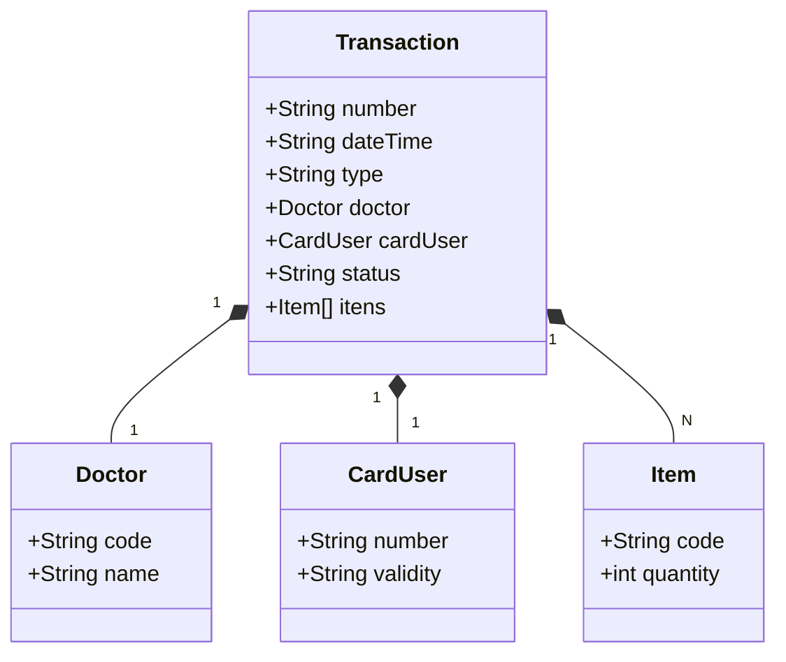

# testando-mermaid

```mermaid
classDiagram
    class Transaction {
        +String number
        +String dateTime
        +String type
        +Doctor doctor
        +CardUser cardUser        
        +String status
        +Item[] itens
    }
    class Doctor {
        +String code
        +String name
    }
    class CardUser {
        +String number
        +String validity
    }
    class Item {
        +String code
        +int quantity
    }
    Transaction "1" *-- "1" Doctor
    Transaction "1" *-- "1" CardUser
    Transaction "1" *-- "N" Item
```
